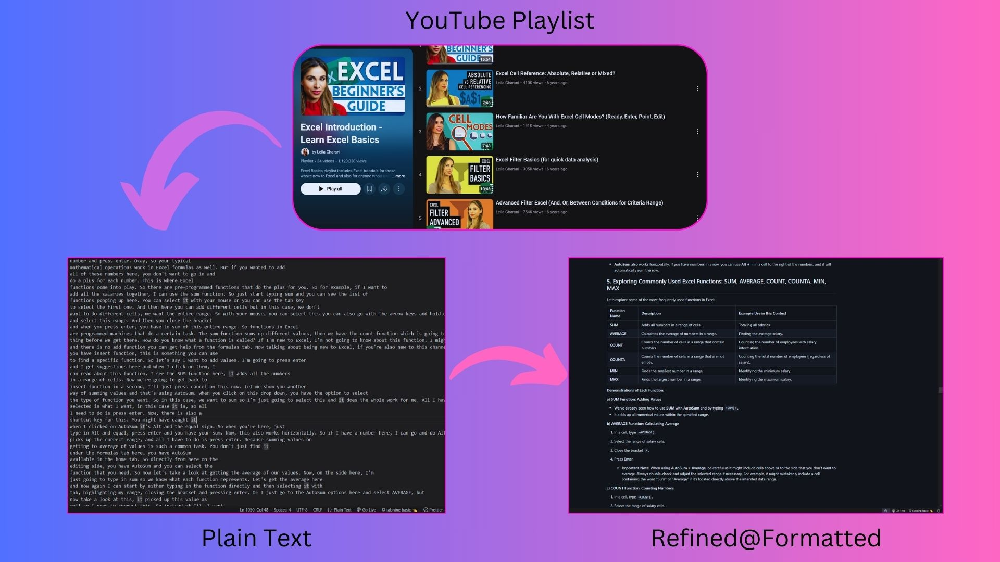
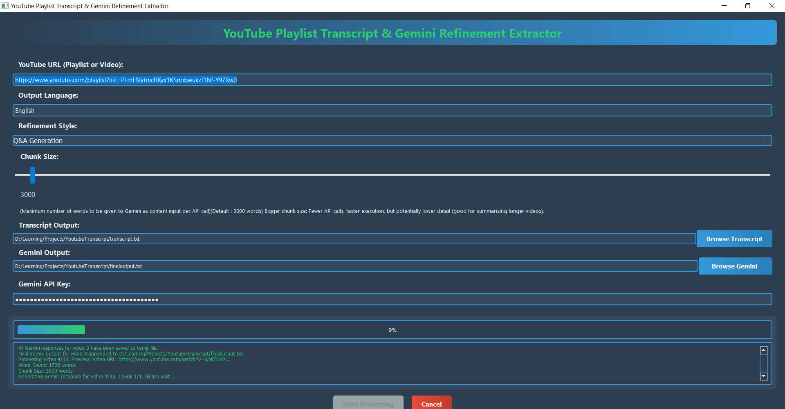
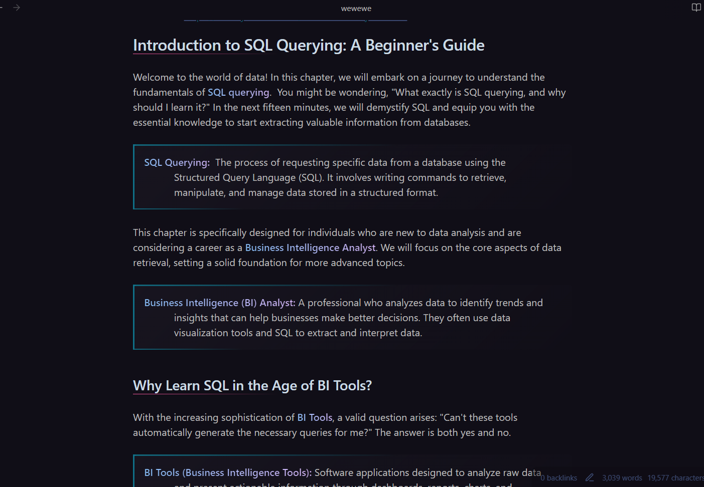
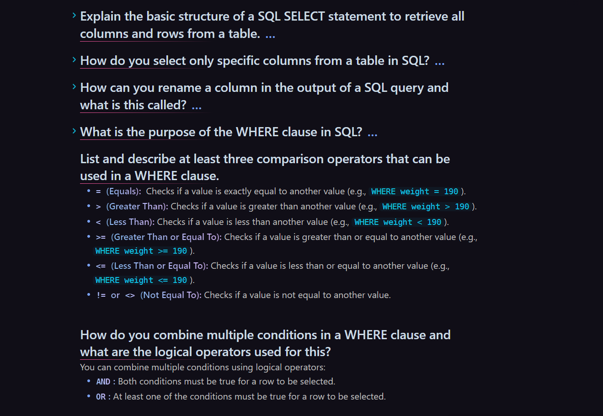

# YouTube Playlist Processor

<br><br>

<br><br>

✅ **Multiple Refinement Styles — Checkboxes**  
> You can now select **one or more** refinement styles at the same time. The application will generate **separate output files** for each selected style, each appended with `[StyleName]` in its filename.  
> For example, if you check “Balanced and Detailed” and “Educational”, you will end up with two `.md` files per video:
> ```
> AI_News_OpenAI_Just_Dropped_An_Amazing_New_Model! [Balanced and Detailed].md
> AI_News_OpenAI_Just_Dropped_An_Amazing_New_Model! [Educational].md
> ```

Here’s a quick rundown of the available styles:

>> ⚖️ **Balanced and Detailed**  
>> - Provides a comprehensive refinement of the transcript.  
>> - Organizes text into a well-structured, readable format with headings, bullet points, and bold text.  
>> - Preserves **every detail, context, and nuance** of the original content.  
>> - Ideal when you want a thoroughly enhanced transcript without any information loss.

>> 📝 **Summary**  
>> - Generates a **concise and informative** summary.  
>> - Identifies the core message, main arguments, and key pieces of information.  
>> - Great for quickly grasping **the main points** without reading the entire transcript.

>> 📚 **Educational**  
>> - Transforms the transcript into a **structured educational text**, like a textbook chapter.  
>> - Organizes content with headings, subheadings, and bullet points for clarity.  
>> - **Identifies and defines technical terms** in blockquotes near their first mention.  
>> - Perfect for learning or study materials (see example image below).

>> ✍️ **Narrative Rewriting**  
>> - **Rewrites** the transcript into an **engaging narrative** or story format.  
>> - Stays faithful to the original topics but uses storytelling techniques to enhance readability and enjoyment.

>> ❓ **Q&A Generation**  
>> - Generates a set of **questions and answers** based on the transcript.  
>> - Each question is presented as a **foldable header** in Markdown (`### Question Text`), with the answer hidden below.  
>> - Excellent for self-assessment, quizzes, or study guides (see example image below).

<br>

✅ **Language Support**: Choose the language of your output.  
✅ **Single Video URL**: You can provide a single video link instead of a playlist.  
✅ **Configurable Chunk Size**: Control the number of words per API call to Gemini.  
✅ **Specify Start and End Video Indices** for partial playlist processing.  
✅ **One Markdown File Per Video** in an output folder, each refined according to your selected style(s).  

<br>

>> **Chunk Size**  
>> - A video is divided into chunks for processing by the AI.  
>> - For example, if you set a chunk size of 3000 words and a video has 8000 words, it’s processed in three chunks (3000, 3000, 2000).  
>> - **Larger chunk sizes** can reduce API calls and speed up processing but risk losing detail or hitting token limits.  
>> - **Smaller chunk sizes** increase API calls but can preserve more nuance.  

<br>

This Python application extracts transcripts from YouTube playlists (or single videos) and **refines** them using the **Google Gemini API** (which is free).  
It takes a YouTube URL as input, extracts transcripts for each video, and then uses Gemini to **reformat and improve readability**.  

**The result** is multiple Markdown files (one per video **and** per selected style) — so you can create a neatly formatted “book” out of a YouTube playlist!  

- Works nicely as an input source for NotebookLM or as a set of documents in Obsidian.  
- Check out this [Medium Article](https://medium.com/@ebrahimgolriz444/a-tool-to-turn-entire-youtube-playlists-to-markdown-formatted-and-refined-text-books-in-any-3e8742f5d0d3) for more details.

<br>

*   Batch processing of entire playlists  
*   User-friendly PyQt5 graphical interface  
*   Selectable Gemini models  
*   Process specific segments of playlists by specifying start/end points  
<br><br>

<br><br>


## Features
- 🎥 Automatic transcript extraction from YouTube playlists
- 🧠 AI-powered text refinement using Gemini models
- 📁 Configurable output file paths
- ⏳ Progress tracking for both extraction and refinement
- 📄 Output to formatted markdown files, one per video **per selected style**
- 🔢 Selective playlist processing with start/end index options

## Requirements
- Python 3.9+
- Google Gemini API key
- YouTube playlist or single video URL

## Installation
```bash
pip install -r requirements.txt
```

## How does it work?
1. **Transcript Extraction**: Fetches the transcript of every video in the playlist (or the single video provided).  
2. **Chunking**: Because Gemini has limited context windows, each video’s text is divided into chunks (default 3000 words, adjustable via slider).  
3. **Refinement by Gemini**:  
   - Each chunk is sent to the Gemini API with a style-specific prompt (e.g., “Educational”).  
   - The refined text is appended to the final output.  
4. **Multiple Styles**: If you select multiple styles, the script repeats the refinement step for each style, writing each style’s result into a separate `.md` file.  
5. **Final Output**: You get a folder full of Markdown files — one per video **for each** refinement style you chose.

## Usage
1. **Obtain a Gemini API Key**: from [Google AI Studio](https://ai.google.dev/gemini-api/docs/api-key).
2. **Run the Application**:
    ```bash
    python main.py
    ```
3. **In the GUI**:
   - Enter the YouTube **Playlist URL** or **single Video link**.
   - Select your desired **Refinement Styles** (one or more).
   - Type your **Output Language**.
   - Adjust the **Chunk Size** slider if needed.
   - (Optional) Set **Start** and **End** video indices for partial playlist processing.
   - Choose an **output folder** for the refined `.md` files.
   - (Optional) set a custom transcript output file if desired.
   - Enter your **Gemini API key**.
   - Click **Start Processing** and watch progress in the status area.

<br>


_Example of Educational Style with definitions in blockquotes_

<br><br>


_Example of Q&A Style, with foldable Q&A sections_

<br><br>

> **Example YouTube playlist** used for screenshots:  
> https://www.youtube.com/playlist?list=PLmHVyfmcRKyx1KSoobwukzf1Nf-Y97Rw0  

---  

Enjoy quickly turning your YouTube playlists into refined Markdown “books” with definitions, summaries, Q&As, and more!