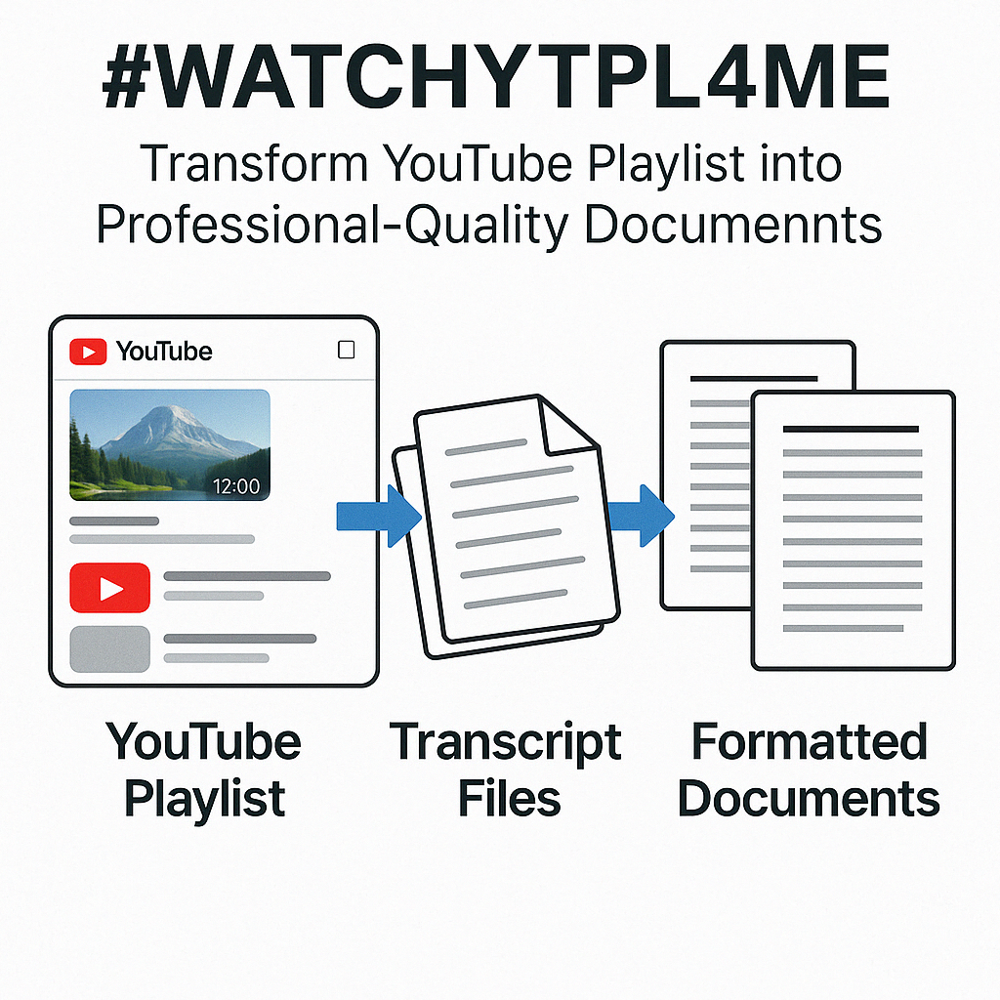
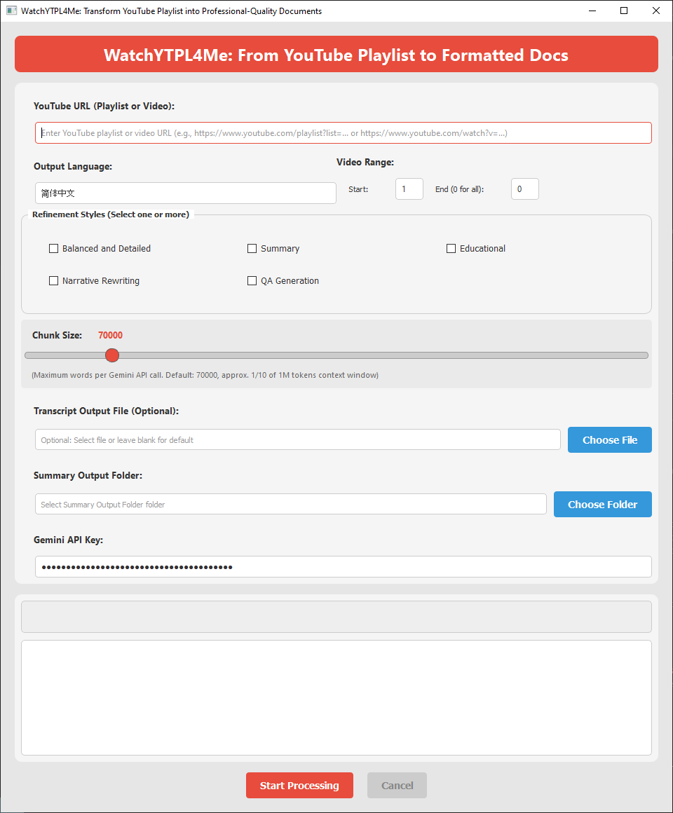
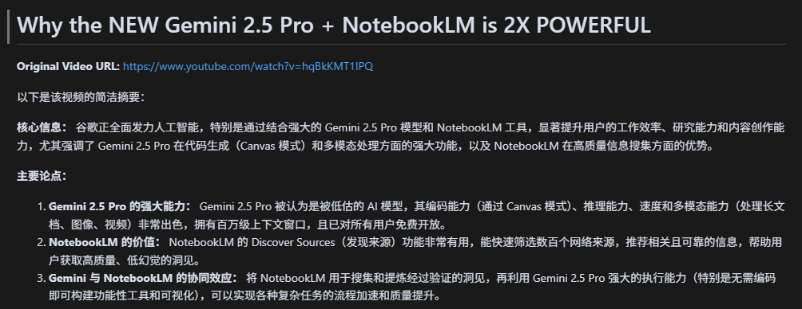

# WatchYTPL4Me: Transform YouTube Playlist into Professional-Quality Documents

## Project Overview

This toolkit transforms YouTube videos and playlists into highly polished text documents. It combines multiple AI-powered features to extract, transcribe, and refine video content into well-structured, readable formats.

The suite offers a streamlined process for transforming video content:
1. **Transcript Extraction**: For videos with existing captions, extracts them directly. For videos without captions, uses OpenAI's gpt-4o-transcribe model to generate high-quality transcripts.
2. **Content Refinement**: All transcripts, whether extracted or AI-generated, are then processed and refined using Google's Gemini API to create polished, formatted documents in various styles.

Whether you're a student creating study materials, a researcher processing interviews, or a content creator repurposing video content, this toolkit provides flexible options to convert YouTube content into clean, formatted text in multiple styles and languages.

- Works nicely as an input source for NotebookLM or as a set of documents in Obsidian.  
- Check out this [Medium Article](https://medium.com/@ebrahimgolriz444/a-tool-to-turn-entire-youtube-playlists-to-markdown-formatted-and-refined-text-books-in-any-3e8742f5d0d3) from the original author for more details.

<br>

<table>
  <tr>
    <td></td>
    <td></td>
  </tr>
</table>

<br>


## Features
- 🎥 Automatic transcript extraction from YouTube playlists
- 🖥️ User-friendly UI with intuitive controls and progress updates
- 🧠 AI-powered text refinement using Gemini models (Select between 2.5 Pro and Flash)
- 🎙️ High-quality audio transcription using OpenAI's gpt-4o-transcribe
- 📁 Configurable output file paths
- ⏳ Progress tracking for both extraction and refinement
- 📄 Output to formatted markdown files, one per video **per selected style**
- 🔢 Selective playlist processing with start/end index options

<br>


## Highlights

### 1️⃣ Text Refinement Styles
#### I. Create Multiple Styles of Documents from the Same Video:
> You can select **one or more** refinement styles at the same time. The application will generate **separate output files** for each selected style, each appended with `[StyleName]` in its filename.  
> For example, if you check "Balanced and Detailed" and "Educational", you will end up with two `.md` files per video:
> ```
> AI_News_OpenAI_Just_Dropped_An_Amazing_New_Model! [Balanced and Detailed].md
> AI_News_OpenAI_Just_Dropped_An_Amazing_New_Model! [Educational].md
> ```

#### II. Choose from Presets of Styles or Customize:
Here is a quick rundown of the available styles. **Note**: You can customize the styles in `prompts.py`.

>> ⚖️ **Balanced and Detailed**  
>> - Provides a comprehensive refinement of the transcript.  
>> - Organizes text into a well-structured, readable format with headings, bullet points, and bold text.  
>> - Preserves **every detail, context, and nuance** of the original content.  
>> - Ideal when you want a thoroughly enhanced transcript without any information loss.

>> 📝 **Summary**  
>> - Generates a **concise and informative** summary.  
>> - Identifies the core message, main arguments, and key pieces of information.  
>> - Great for quickly grasping **the main points** without reading the entire transcript.

>> 📚 **Educational**  
>> - Transforms the transcript into a **structured educational text**, like a textbook chapter.  
>> - Organizes content with headings, subheadings, and bullet points for clarity.  
>> - **Identifies and defines technical terms** in blockquotes near their first mention.  
>> - Perfect for learning or study materials (see example image below).

>> ✍️ **Narrative Rewriting**  
>> - **Rewrites** the transcript into an **engaging narrative** or story format.  
>> - Stays faithful to the original topics but uses storytelling techniques to enhance readability and enjoyment.

>> ❓ **Q&A Generation**  
>> - Generates a set of **questions and answers** based on the transcript.  
>> - Each question is presented as a **foldable header** in Markdown (`### Question Text`), with the answer hidden below.  
>> - Excellent for self-assessment, quizzes, or study guides (see example image below).

<br>

### 2️⃣ AI-Powered Audio Transcription

We've added the capability to transcribe YouTube videos using OpenAI's powerful GPT-4o-transcribe model:

>> 🎙️ **Direct Audio Transcription**
>> - Extract high-quality transcripts from YouTube videos using OpenAI's gpt-4o-transcribe model
>> - Audio is automatically downloaded, intelligently segmented based on silence detection, and transcribed
>> - Handles videos in multiple languages with excellent accuracy
>> - Perfect for videos without available captions or when higher quality transcription is needed

>> 🔊 **Intelligent Audio Processing**
>> - Automatically segments audio based on natural speech pauses using silence detection
>> - Limits chunk size to 10 minutes maximum to ensure optimal transcription quality
>> - Optimized 128kbps audio quality balances file size and transcription accuracy
>> - Optional cleanup of intermediate audio files after processing

>> 🛠️ **Easy Integration**
>> - Use `ytvideo2txt.py` as a standalone tool or integrate with the main application
>> - Process a single video with one command: `python ytvideo2txt.py`
>> - Requires an OpenAI API key set as an environment variable (`OPENAI_API_KEY`)

<br>

### 3️⃣ Flexible Settings

✅ **Language Support**: Choose the language of your output.  
✅ **Single Video URL**: You can provide a single video link instead of a playlist.  
✅ **Configurable Chunk Size**: Control the number of words per API call to Gemini.  
✅ **Specify Start and End Video Indices** for partial playlist processing.  
✅ **One Markdown File Per Video** in an output folder, each refined according to your selected style(s).  

<br>

>> **Chunk Size**  
>> - A video is divided into chunks for processing by the AI.  
>> - For example, if you set a chunk size of 3000 words and a video has 8000 words, it's processed in three chunks (3000, 3000, 2000).  
>> - **Larger chunk sizes** can reduce API calls and speed up processing but risk losing detail or hitting token limits.  
>> - **Smaller chunk sizes** increase API calls but can preserve more nuance.  

<br>

## How does it work?
1. **Show GUI**: Opens a user-friendly GUI created using `PyQt5`.
2. **Transcript Extraction**: Fetches the transcript of every video in the playlist (or the single video provided) using `youtube_transcript_api`. Video titles are parsed using `pytubefix`.  
3. **Audio Transcription (if needed)**: For videos without available transcripts, `ytvideo2txt` downloads the audio, segments it based on silence, and transcribes using OpenAI's gpt-4o-transcribe model.
4. **Chunking**: Because Gemini has 1M token context windows, each video's text can be divided into chunks of 1/10 of the context window (default 70000 words, adjustable via slider).  
5. **Refinement by Gemini**:
   - The default output language is defined in `.env`. User can modify. 
   - Each chunk is sent to the Gemini API with a style-specific prompt (e.g., "Educational").  
   - The refined text is appended to the final output.  
6. **Multiple Styles**: If you select multiple styles, the script repeats the refinement step for each style, writing each style's result into a separate `.md` file.  
7. **Final Output**: You get a folder full of Markdown files — one per video **for each** refinement style you chose.

<br>

## Requirements
- Python 3.9+
- Google Gemini API key
- OpenAI API key (for audio transcription feature)
- YouTube playlist or single video URL
- ffmpeg (for audio processing and transcription)

## Installation
```bash
pip install -r requirements.txt
```

## Usage
1. **Obtain API Keys**:
   - Get a Gemini API Key from [Google AI Studio](https://ai.google.dev/gemini-api/docs/api-key)
   - For the audio transcription feature, get an OpenAI API key from [OpenAI Platform](https://platform.openai.com/)
2. **Run the Application**:
   - Method 1: Double click on main.pyw (or its shortcut) to run.
   - Method 2: Rename main.pyw back to main.py, then:
    ```bash
    python main.py
    ```
3. **In the GUI**:
   - Enter the YouTube **Playlist URL** or **single Video link**.
   - Select your desired **Refinement Styles** (one or more).
   - Type your **Output Language**.
   - Adjust the **Chunk Size** slider if needed.
   - (Optional) Set **Start** and **End** video indices for partial playlist processing.
   - Choose an **output folder** for the refined `.md` files.
   - (Optional) set a custom transcript output file if desired.
   - Enter your **Gemini API key**.
   - Click **Start Processing** and watch progress in the status area.

### Using Audio Transcription
To use the audio transcription feature:
1. Set your OpenAI API key as an environment variable:
   ```bash
   # Linux/Mac
   export OPENAI_API_KEY=your_api_key_here
   
   # Windows
   set OPENAI_API_KEY=your_api_key_here
   ```
2. Run the transcription script directly:
   ```bash
   python ytvideo2txt.py
   ```
   Or modify the URL and title in the script to process a specific video.


<br>

## Output Example


<br>
---  

Enjoy quickly turning your YouTube playlists into refined Markdown "books" with definitions, summaries, Q&As, and more!

---

This project is a modified and enhanced version of https://github.com/Ebrizzzz/Youtube-playlist-to-formatted-text by Ebrahim Golriz. The updates are licensed under the same MIT License.